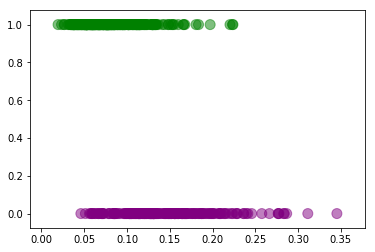
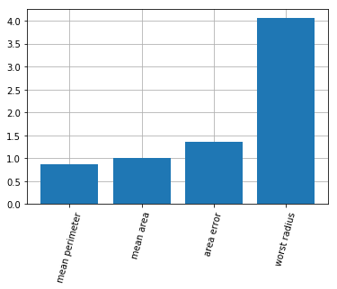
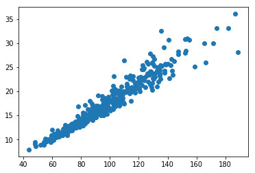
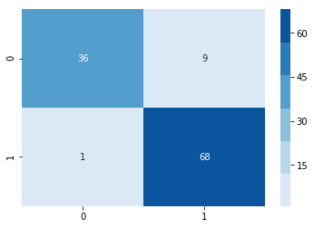

### Questions

### Objectives
YWBAT
- explain gradient descent in logistic regression
    - what is the purpose of gradient descent?
        - minimize the loss function
            $$ \log(L) = \log((y - y_{hat})^2) $$
        - finding the lowest point of the loss function
        - starting at some set of beta parameters
        - calculate the gradient at that point then adjust the beta parameters
        - beta parameters are adjusted by
            - $B_{new} = B_{old} - \alpha * G(B)$
    - how is gradient descent different in logistic regression?
        - the cost function is different, because it's a  logloss function, because yhat is a sigmoid
    - what are important hyper-parameters of gradient descent?
        - learning rate
        - number of iterations
        - cost function
        - tolerance
        - C 
        - regularization parameter
            - Lasso - l1
            - Ridge - l2
    - what is/are another example of a sigmoid function?
        - $\tanh(x)$
        - erf
- iterate through models to solve a problem

### Outline


```python
import pandas as pd
import numpy as np

from sklearn.datasets import load_breast_cancer
from sklearn.preprocessing import StandardScaler
from sklearn.feature_selection import SelectKBest, chi2, SelectFdr
from sklearn.linear_model import LogisticRegression
from sklearn.model_selection import cross_val_score, GridSearchCV, KFold, train_test_split
from sklearn.metrics import accuracy_score, confusion_matrix, precision_recall_fscore_support


import matplotlib.pyplot as plt
import seaborn as sns
```


```python
breast_cancer = load_breast_cancer()
data = breast_cancer.data
target = breast_cancer.target
features = breast_cancer.feature_names
```


```python
df = pd.DataFrame(data, columns=features)
df['target'] = target
print(df.shape)
df.head()
```

    (569, 31)


<div>
<style scoped>
    .dataframe tbody tr th:only-of-type {
        vertical-align: middle;
    }

    .dataframe tbody tr th {
        vertical-align: top;
    }

    .dataframe thead th {
        text-align: right;
    }
</style>
<table border="1" class="dataframe">
  <thead>
    <tr style="text-align: right;">
      <th></th>
      <th>mean radius</th>
      <th>mean texture</th>
      <th>mean perimeter</th>
      <th>mean area</th>
      <th>mean smoothness</th>
      <th>mean compactness</th>
      <th>mean concavity</th>
      <th>mean concave points</th>
      <th>mean symmetry</th>
      <th>mean fractal dimension</th>
      <th>...</th>
      <th>worst texture</th>
      <th>worst perimeter</th>
      <th>worst area</th>
      <th>worst smoothness</th>
      <th>worst compactness</th>
      <th>worst concavity</th>
      <th>worst concave points</th>
      <th>worst symmetry</th>
      <th>worst fractal dimension</th>
      <th>target</th>
    </tr>
  </thead>
  <tbody>
    <tr>
      <th>0</th>
      <td>17.99</td>
      <td>10.38</td>
      <td>122.80</td>
      <td>1001.0</td>
      <td>0.11840</td>
      <td>0.27760</td>
      <td>0.3001</td>
      <td>0.14710</td>
      <td>0.2419</td>
      <td>0.07871</td>
      <td>...</td>
      <td>17.33</td>
      <td>184.60</td>
      <td>2019.0</td>
      <td>0.1622</td>
      <td>0.6656</td>
      <td>0.7119</td>
      <td>0.2654</td>
      <td>0.4601</td>
      <td>0.11890</td>
      <td>0</td>
    </tr>
    <tr>
      <th>1</th>
      <td>20.57</td>
      <td>17.77</td>
      <td>132.90</td>
      <td>1326.0</td>
      <td>0.08474</td>
      <td>0.07864</td>
      <td>0.0869</td>
      <td>0.07017</td>
      <td>0.1812</td>
      <td>0.05667</td>
      <td>...</td>
      <td>23.41</td>
      <td>158.80</td>
      <td>1956.0</td>
      <td>0.1238</td>
      <td>0.1866</td>
      <td>0.2416</td>
      <td>0.1860</td>
      <td>0.2750</td>
      <td>0.08902</td>
      <td>0</td>
    </tr>
    <tr>
      <th>2</th>
      <td>19.69</td>
      <td>21.25</td>
      <td>130.00</td>
      <td>1203.0</td>
      <td>0.10960</td>
      <td>0.15990</td>
      <td>0.1974</td>
      <td>0.12790</td>
      <td>0.2069</td>
      <td>0.05999</td>
      <td>...</td>
      <td>25.53</td>
      <td>152.50</td>
      <td>1709.0</td>
      <td>0.1444</td>
      <td>0.4245</td>
      <td>0.4504</td>
      <td>0.2430</td>
      <td>0.3613</td>
      <td>0.08758</td>
      <td>0</td>
    </tr>
    <tr>
      <th>3</th>
      <td>11.42</td>
      <td>20.38</td>
      <td>77.58</td>
      <td>386.1</td>
      <td>0.14250</td>
      <td>0.28390</td>
      <td>0.2414</td>
      <td>0.10520</td>
      <td>0.2597</td>
      <td>0.09744</td>
      <td>...</td>
      <td>26.50</td>
      <td>98.87</td>
      <td>567.7</td>
      <td>0.2098</td>
      <td>0.8663</td>
      <td>0.6869</td>
      <td>0.2575</td>
      <td>0.6638</td>
      <td>0.17300</td>
      <td>0</td>
    </tr>
    <tr>
      <th>4</th>
      <td>20.29</td>
      <td>14.34</td>
      <td>135.10</td>
      <td>1297.0</td>
      <td>0.10030</td>
      <td>0.13280</td>
      <td>0.1980</td>
      <td>0.10430</td>
      <td>0.1809</td>
      <td>0.05883</td>
      <td>...</td>
      <td>16.67</td>
      <td>152.20</td>
      <td>1575.0</td>
      <td>0.1374</td>
      <td>0.2050</td>
      <td>0.4000</td>
      <td>0.1625</td>
      <td>0.2364</td>
      <td>0.07678</td>
      <td>0</td>
    </tr>
  </tbody>
</table>
<p>5 rows × 31 columns</p>
</div>


```python
df.columns
```


    Index(['mean radius', 'mean texture', 'mean perimeter', 'mean area',
           'mean smoothness', 'mean compactness', 'mean concavity',
           'mean concave points', 'mean symmetry', 'mean fractal dimension',
           'radius error', 'texture error', 'perimeter error', 'area error',
           'smoothness error', 'compactness error', 'concavity error',
           'concave points error', 'symmetry error', 'fractal dimension error',
           'worst radius', 'worst texture', 'worst perimeter', 'worst area',
           'worst smoothness', 'worst compactness', 'worst concavity',
           'worst concave points', 'worst symmetry', 'worst fractal dimension',
           'target'],
          dtype='object')


```python
df.target.value_counts()
```


    1    357
    0    212
    Name: target, dtype: int64


```python
# Let's do some eda
feature_corr = []
for feature in features:
    corr = np.corrcoef(df[feature], target)[0][1]
    feature_corr.append([feature, corr, np.abs(corr)])
    
feature_corr = sorted(feature_corr, key=lambda x: x[2], reverse=True)
feature_corr[:5]
```


    [['worst concave points', -0.7935660171412687, 0.7935660171412687],
     ['worst perimeter', -0.7829141371737581, 0.7829141371737581],
     ['mean concave points', -0.7766138400204345, 0.7766138400204345],
     ['worst radius', -0.7764537785950383, 0.7764537785950383],
     ['mean perimeter', -0.7426355297258318, 0.7426355297258318]]


### Let's do more EDA but first let's look at features


```python
kbest = SelectKBest(chi2, k=5)
```


```python
kbest.fit_transform(df.drop('target', axis=1), df['target'])
```


    array([[ 122.8 , 1001.  ,  153.4 ,  184.6 , 2019.  ],
           [ 132.9 , 1326.  ,   74.08,  158.8 , 1956.  ],
           [ 130.  , 1203.  ,   94.03,  152.5 , 1709.  ],
           ...,
           [ 108.3 ,  858.1 ,   48.55,  126.7 , 1124.  ],
           [ 140.1 , 1265.  ,   86.22,  184.6 , 1821.  ],
           [  47.92,  181.  ,   19.15,   59.16,  268.6 ]])


```python
kbest.get_support()
```


    array([False, False,  True,  True, False, False, False, False, False,
           False, False, False, False,  True, False, False, False, False,
           False, False, False, False,  True,  True, False, False, False,
           False, False, False])


```python
X_5 = df.loc[:, kbest.get_support()].drop("worst perimeter", axis=1)
X_5.head()
```


<div>
<style scoped>
    .dataframe tbody tr th:only-of-type {
        vertical-align: middle;
    }

    .dataframe tbody tr th {
        vertical-align: top;
    }

    .dataframe thead th {
        text-align: right;
    }
</style>
<table border="1" class="dataframe">
  <thead>
    <tr style="text-align: right;">
      <th></th>
      <th>mean perimeter</th>
      <th>mean area</th>
      <th>area error</th>
      <th>worst radius</th>
    </tr>
  </thead>
  <tbody>
    <tr>
      <th>0</th>
      <td>122.80</td>
      <td>1001.0</td>
      <td>153.40</td>
      <td>25.38</td>
    </tr>
    <tr>
      <th>1</th>
      <td>132.90</td>
      <td>1326.0</td>
      <td>74.08</td>
      <td>24.99</td>
    </tr>
    <tr>
      <th>2</th>
      <td>130.00</td>
      <td>1203.0</td>
      <td>94.03</td>
      <td>23.57</td>
    </tr>
    <tr>
      <th>3</th>
      <td>77.58</td>
      <td>386.1</td>
      <td>27.23</td>
      <td>14.91</td>
    </tr>
    <tr>
      <th>4</th>
      <td>135.10</td>
      <td>1297.0</td>
      <td>94.44</td>
      <td>22.54</td>
    </tr>
  </tbody>
</table>
</div>


```python
X_5.shape, df.target.shape
```


    ((569, 11), (569,))


```python
colors = ['green' if j == 1 else 'purple' for j in df.target]
plt.scatter(df['mean compactness'], df.target, c=colors, s=100, alpha=0.5)
plt.show()
```





```python
scaler = StandardScaler()
scaler.fit(X_5)
X_5_scaled = scaler.transform(X_5)
```

### build a baseline model


```python
logreg = LogisticRegression(verbose=2, n_jobs=-1)
```


```python
xtrain, xtest, ytrain, ytest = train_test_split(X_5_scaled, target, test_size=0.20)
```


```python
logreg.fit(xtrain, ytrain)
```

    [LibLinear]

    /anaconda3/lib/python3.7/site-packages/sklearn/linear_model/logistic.py:432: FutureWarning: Default solver will be changed to 'lbfgs' in 0.22. Specify a solver to silence this warning.
      FutureWarning)
    /anaconda3/lib/python3.7/site-packages/sklearn/linear_model/logistic.py:1544: UserWarning: 'n_jobs' > 1 does not have any effect when 'solver' is set to 'liblinear'. Got 'n_jobs' = 8.
      " = {}.".format(effective_n_jobs(self.n_jobs)))


    LogisticRegression(C=1.0, class_weight=None, dual=False, fit_intercept=True,
                       intercept_scaling=1, l1_ratio=None, max_iter=100,
                       multi_class='warn', n_jobs=-1, penalty='l2',
                       random_state=None, solver='warn', tol=0.0001, verbose=2,
                       warm_start=False)


```python
logreg.score(xtest, ytest), logreg.score(xtrain, ytrain)
```


    (0.9122807017543859, 0.9208791208791208)


```python
logreg.coef_[0]
```


    array([-0.86521626,  0.99808964, -1.35927999, -4.05730792])


```python
plt.bar(x=range(len(X_5.columns.values)), height=list(np.abs(logreg.coef_[0])), zorder=3)
plt.grid(zorder=0)
plt.xticks(range(len(X_5.columns.values)), X_5.columns, rotation=75)
plt.show()
```





```python
plt.scatter(df["mean perimeter"], df["worst radius"])
```


    <matplotlib.collections.PathCollection at 0x1a2fb477f0>





```python
preds = logreg.predict(xtest)
cm = confusion_matrix(ytest, preds)
```


```python
sns.heatmap(cm, fmt='0g', annot=True, cmap=sns.color_palette('Blues'))
```


    <matplotlib.axes._subplots.AxesSubplot at 0x1a2fd8e240>





### Assessment
- Learnt about making models to figure out which features to focus on
- I learned about `SelectKBest`
- I learned that the loss function for logistic regression is actually the log loss function because we take the log of the squared error for calculating the min.
I am also still pretty hazy on logistic gradient descent though… probably need more practice.
